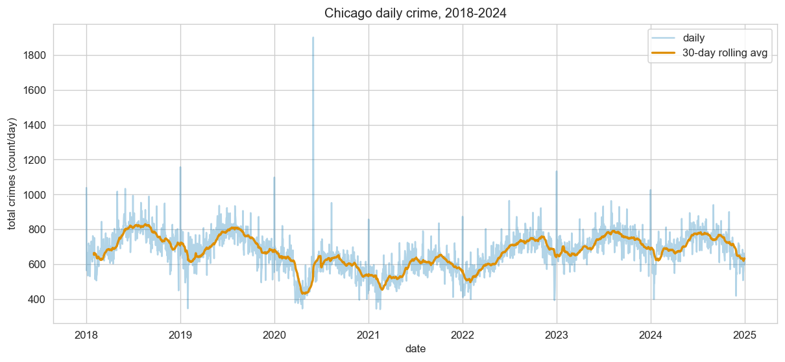
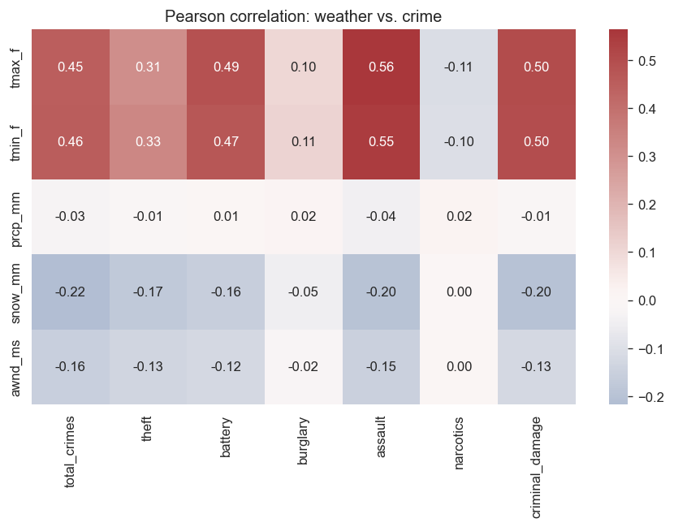
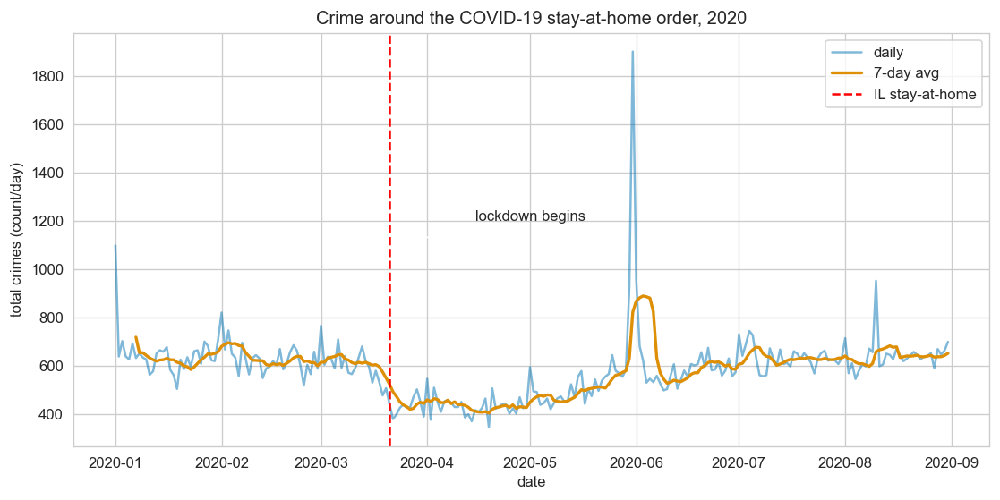
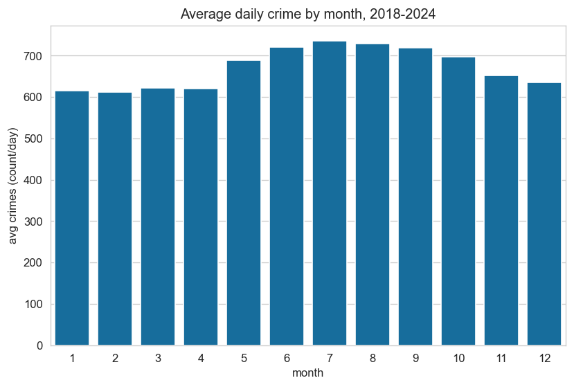
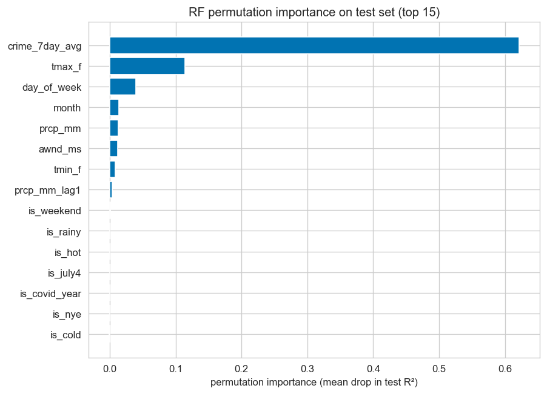
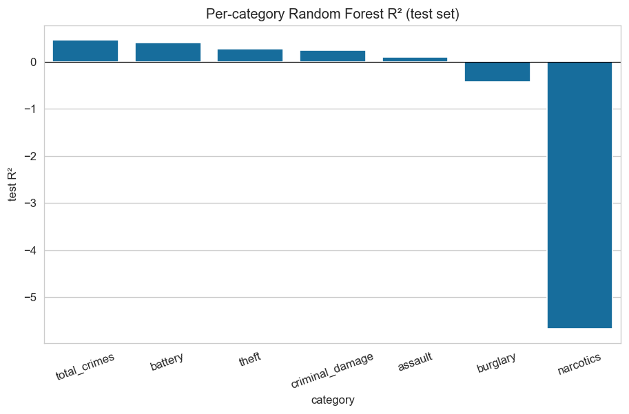

# Weather and Crime in Chicago: Predicting Daily Crime Volume from Weather Conditions

**Author:** Feruz Karimov
**Course:** CS 210, Data Management for Data Science
**Date:** May 2026
**GitHub:** https://github.com/feruzkarimovv/chicago-weather-crime
**Demo:** <<YouTube URL pending>>

---

## 1. Project Definition

### 1.1 Problem Statement

The City of Chicago publishes block-level crime records that are updated almost in real-time, and NOAA records daily weather at O'Hare going back to 1946. Both are open. Whether one predicts the other is a fair question for anyone who has to allocate police shifts, emergency-room staff, or city budgets. It also has decades of academic attention because hot days and aggression have shown up together in the literature for a long time. I wanted to take a look on recent Chicago data.

The question I ended up settling on was specific: can daily weather (temperature, precipitation, wind) predict daily crime volume (overall and by category) in Chicago between 2018 and 2024?

I had three expectations going in. First, that maximum temperature would correlate positively with total crime. The "heat hypothesis" goes back to Anderson [3] and is folk wisdom even outside academia, so a clear positive r was the baseline expectation. Second, that precipitation would suppress outdoor-opportunity crime like theft, since rain limits the pedestrian activity that creates targets. Third, and the one I cared about most, that day-of-week effects would be larger than weather effects in absolute terms. If you can predict crime well from "is it Saturday?", then a Random Forest with seventeen features doesn't really have to do all that much work.

### 1.2 Connection to Course Material

This project hits most of CS 210 directly. Lecture 5.2 (data collection) shows up in Phase 1, where I pull the crime CSV from the city portal and the weather CSV from NOAA. Lectures 4.2 and 5.1 on pandas cleaning are essentially the whole content of Phase 2: parsing dates, dropping nulls, deduping IDs, applying NOAA's tenths-of-units conventions. The groupby and join material from 6.1 is how I go from per-incident crime records to daily counts and then merge weather in. Feature engineering (lecture 6.2) gives me the lag features, rolling averages, and binary flags that the models actually use. Visualization (7.1) covers the EDA notebook's nine figures. SQL is in Phase 3, where I set up three SQLite tables and write six queries that exercise JOINs, CASE WHEN, window functions, and a CTE.

ML evaluation comes in at the end. I use MAE and RMSE for absolute error, R² for variance explained, and `TimeSeriesSplit` for cross-validation; random KFold would have leaked future weather into the training fold.

---

## 2. Novelty and Importance

### 2.1 Importance of the Project

Crime affects daily life, business decisions, and city budgets. If you can predict tomorrow's volume from features available at 6 AM, you can shift patrol schedules, ER staffing, and even where to deploy parking enforcement. The "weather affects crime" claim shows up in news articles every summer, but it's worth knowing whether it's actually a useful predictive signal or just folklore.

The heat hypothesis is well-attested in the literature, but how big is the effect compared to things people already know about, like day-of-week patterns? If the answer is "weather matters a lot less than what day it is," that's a useful result for anyone designing alerting systems, doing research, or just talking about the topic.

Climate change makes it more relevant, not less. The fraction of summer days above 85°F in Chicago has been creeping up. If hot days have a measurable bump in crime volume, then the next decade should see slow drift in city-level patterns. Quantifying it now sets a baseline.

### 2.2 Excitement and Relevance

I picked this because I grew up near Chicago and have always wondered if the "always more crime in summer" thing my parents said was a real pattern or just the news cycle being bad in summer. It turns out there's a real seasonal swing of about 20%, much smaller than I'd assumed but bigger than zero. The narcotics result, where temperature actually correlates *negatively*, was the biggest surprise of the project. I expected weather to matter; I didn't expect any category to go in the opposite direction.

### 2.3 Review of Related Work

Anderson's 2001 review [3] in *Current Directions in Psychological Science* synthesizes decades of psychology research connecting heat and aggression. The basic finding is that hotter temperatures are associated with more violent crime (assault in particular) both in lab and field studies. The mechanism is debated (physiological arousal, more time outdoors, more alcohol, all overlap) but the effect is reliably observed across designs.

Field's 1992 study [4] in *British Journal of Criminology* looked at daily crime in England and Wales over a multi-year window and found temperature-crime relationships at about the granularity I use here. He distinguished violent crime (which tracks temperature) from property crime (more equivocal), and separated weather effects from longer-term trends, something I tried to mimic with a chronological train/test split.

Ranson's 2014 paper [5] in the *Journal of Environmental Economics and Management* projects long-run effects of climate change on crime in the US, using daily weather and FBI Uniform Crime Reports. He finds modest but real long-run impacts. His paper convinced me that the per-category breakdown matters: the headline "crime rises with temperature" hides that some categories are temperature-sensitive and others basically aren't.

This project differs in three ways. I use daily granularity (Field used monthly, Anderson used cross-sectional). I model multiple categories rather than a single index. And the whole pipeline is reproducible. Anyone with Python can clone the repo and re-run everything end-to-end.

---

## 3. Progress and Contribution

### 3.1 Data Utilization

The Chicago crime data comes from the City of Chicago Open Data Portal, *Crimes – 2001 to Present*, which is updated daily and currently sits at about 8.5 million records going back to 2001. I pulled the bulk CSV (~1.9 GB at the time of writing, quite a bit larger than the version most articles describe) and filtered to the 2018–2024 window. After deduplicating on the city's `id` field and dropping rows with missing dates or categories, I ended up with 1,715,802 records. Each row is one incident with a timestamp, a top-level category (the `Primary Type` field), a description, the arrest and domestic flags, and a block-level approximate location.

Weather comes from NOAA's Global Historical Climatology Network – Daily, station USW00094846, which is Chicago O'Hare. The full file goes back to 1946; I filtered to 2018–2024 to match. NOAA stores TMAX and TMIN in tenths of degrees Celsius, and PRCP and AWND in tenths of millimeters and meters per second respectively. Forgetting to divide by 10 is the classic bug here. I caught it early. Snow and snow-depth are in millimeters as recorded. Missing values are rare in this window: zero percent across all six weather columns. The forward-fill and median-impute logic the spec called for was coded but didn't actually fire because there was nothing to clean.

Aggregating daily, I collapsed the 1.72 million crime records to one row per day with total counts, per-category counts for the six target categories, and arrest/domestic counts. Inner-joining to weather on date kept all 2,557 days. The two datasets cover the same window without any gaps. The final merged table sits in `data/processed/merged.csv`.

For the database, I built three SQLite tables: `weather`, `crime_daily`, and `features`. All three are indexed on date. I wrote six demo SQL queries: average crime by month; top-10 hottest days with crime counts (a JOIN); rainy-vs-dry breakdown (CASE WHEN); per-category totals by season; a 7-day rolling average via a window function; and a day-of-week × temperature-bin breakdown via a CTE.



*Figure 1: Daily total crime in Chicago, 2018–2024, with 30-day rolling average overlaid. The COVID dip in March–June 2020 is the single clearest break in the series. (Source: NOAA GHCN-D and Chicago Data Portal, 2018–2024.)*



*Figure 2: Pearson correlations between weather variables and per-category daily crime counts. TMAX correlates positively with most categories (assault, criminal damage, battery, theft) and slightly negatively with narcotics. PRCP and SNOW are near-zero across the board. (Source: merged.csv, 2018–2024.)*

### 3.2 Models, Techniques, and Algorithms

I compared four predictors. Two are baselines, deliberately weak so the trained models have to clear them by a meaningful margin. The mean baseline simply predicts the average of the training set's daily crime, ignoring everything else. The day-of-week baseline groups by Monday-through-Sunday and predicts the train mean for that day. This second one is the strong baseline; if a model can't beat it, weather isn't doing meaningful predictive work.

The two real models are Ridge regression and Random Forest. Ridge (with `alpha=1.0` on standardized features) handles the multicollinearity between TMAX, TMIN, and the various temperature-derived flags more gracefully than plain OLS. Random Forest (`n_estimators=200, max_depth=15, min_samples_leaf=5`) handles non-linear interactions: a hot Saturday might behave differently from the additive sum of "hot day" plus "Saturday."

Feature engineering happens in `src/features.py` and produces 17 columns. Temporal features include `day_of_week`, `month`, `is_weekend`, and `is_holiday` (using the `holidays` package for US federal). Lag features carry yesterday's TMAX and PRCP, since same-day weather isn't the only thing that matters. The 7-day rolling average of crime, shifted by 1 day so it doesn't leak the label, captures recent trend. Binned flags (`is_rainy` for PRCP > 1 mm, `is_hot` for TMAX > 85°F, `is_cold` for TMIN < 32°F) let the linear model see thresholds. Anomaly flags for `is_covid_year`, `is_nye`, and `is_july4` absorb known structural breaks.

The train/test split is chronological with cutoff 2023-08-01. Train covers 2018-01-08 through 2023-07-31 (2,031 days), test covers 2023-08-01 through 2024-12-31 (519 days). I use `TimeSeriesSplit` with 5 folds for cross-validation on the training set; random KFold would let later-fold features creep into earlier-fold training, which is leakage you can't have on time-series data.

### 3.3 Experimental Design

I expected TMAX to be the strongest weather predictor with positive correlation, precipitation to suppress crime through reduced outdoor activity, and day-of-week effects to dominate weather effects in absolute size. I expected the Random Forest to beat Ridge by capturing non-linear interactions between weather and calendar features.

What would falsify this? If TMAX correlation came in negative or near zero, the heat hypothesis would be wrong for this window. If the day-of-week baseline turned out to be hard to beat, weather would have no incremental signal worth talking about. If RF didn't outperform Ridge at all, then the relationships would be effectively linear and the project's hardest model would be redundant.



*Figure 3: Daily total crime around the March 2020 Illinois stay-at-home order. Daily totals fall sharply in late March and recover only partially through the summer. The COVID dip is the single largest non-seasonal feature in the series and is the reason `is_covid_year` exists as a flag. (Source: Chicago Data Portal, 2020.)*

### 3.4 Key Findings and Results

The headline result is in the comparison table.

| Model | Test MAE | Test RMSE | Test R² | CV MAE (5-fold TS) |
|---|---|---|---|---|
| Mean baseline | 74.95 | 93.75 | -0.589 | n/a |
| Day-of-week mean | 75.19 | 93.24 | -0.571 | n/a |
| Ridge regression | 40.49 | 54.87 | 0.456 | 62.8 ± 30.8 |
| Random Forest | 39.37 | 54.50 | 0.463 | 66.5 ± 37.2 |

The Random Forest beats both baselines by about 47% on test MAE, well above the 5% bar I set going in. Ridge is essentially tied with RF on the test set. The paired t-test on per-fold CV MAE (n = 5 folds) gives t = -0.769, p = 0.485, so I cannot tell them apart at any reasonable significance level. Since both real models perform similarly and the dataset is small, I report RF as the primary model but note that a linear approach would have been almost as good.

One thing worth flagging: both baselines have *negative* R² on the test set. That looks broken at first glance, since R² < 0 means the predictions are worse than predicting the mean of the test set. The reason is that the training mean (~659 crimes/day) sits well below the test mean (~717 in 2023–2024); the train window includes the 2020 COVID dip, and crime drifted upward in 2023–2024 even relative to pre-pandemic levels. The trained models recover through the lagged 7-day rolling average. The takeaway: a fixed-mean baseline is fragile on non-stationary time series, and it has to be locally adaptive to compete.



*Figure 4: Average daily crime by calendar month, 2018–2024. The summer-vs-winter swing is roughly 20%, with July highest (~736) and February lowest (~611). The seasonality this captures is what `month` encodes for the model. (Source: crime_daily, 2018–2024.)*



*Figure 5: Permutation importance on the test set, top 15 features, computed via `sklearn.inspection.permutation_importance` with `n_repeats=10`. The 7-day rolling average dominates, but TMAX, day_of_week, and month carry meaningful weight after that. (Source: RF model on test data.)*

Permuting crime_7day_avg cuts test R² by 0.62, the largest drop of any feature. After that, TMAX (0.11), day_of_week (0.04), and month (0.01) carry meaningful weight. Weather features collectively contribute about 0.15 in dropped R². Less than I'd hoped, but real. Weather matters but it's not the main driver.



*Figure 6: Test R² by crime category for individual Random Forest models. Battery and theft fit reasonably; narcotics goes off a cliff. (Source: `outputs/per_category.csv`.)*

Per-category models are where the project gets more interesting.

| Category | Test R² | Pearson r with TMAX |
|---|---|---|
| Total crimes | 0.463 | 0.453 |
| Battery | 0.403 | 0.493 |
| Theft | 0.269 | 0.313 |
| Criminal damage | 0.236 | 0.501 |
| Assault | 0.090 | 0.563 |
| Burglary | -0.435 | 0.104 |
| Narcotics | -5.669 | -0.107 |

Battery, theft, and criminal damage are weather-sensitive enough to give the model real footing. Burglary and narcotics aren't. Narcotics is the most striking result in the project: its TMAX correlation is slightly *negative* (r = -0.107, p ≈ 5e-8) and its test R² is wildly negative (-5.67). That isn't a model bug. It's a sign that narcotics enforcement levels shifted between the train and test windows in a way that has nothing to do with weather. The per-category split surfaces this; pooling everything into one "total crime" model would have buried it completely.

Statistical tests from the EDA back the same picture. Welch's t-test on rainy vs. dry days: t = -3.51, p ≈ 4.7e-4 (rainy 658, dry 675; n = 667 / 1890). One-way ANOVA across temperature bins: F = 157.3, p ≈ 2e-120 (cold 569 → cool 633 → mild 657 → warm 721 → hot 730). Pearson r for TMAX × total crime: 0.453, 95% CI [0.422, 0.483], p ≈ 1e-129. None of these are subtle effects.

### 3.5 Evaluation

I use three metrics for a reason. MAE is the most intuitive, since it gives the average daily prediction error in raw crimes/day units. A test MAE of 39 means the model is typically off by about 39 crimes on a given day. RMSE penalizes large errors more heavily, so it tells me if the model has occasional big misses; here RMSE is about 1.4× MAE for both Ridge and RF, suggesting the error distribution has a moderate tail but no catastrophic outliers. R² gives the share of test-set variance explained.

Is 0.46 a "good" R²? For social-science prediction with weather features and a year of held-out data, a value in the 0.3–0.5 range is realistic. Human behavior has many drivers I don't measure (sports, schools, economy, enforcement). I treat 0.46 as a meaningful fraction of variance explained, not as evidence of a tight predictive model. The honest framing is that weather plus calendar plus a 7-day trend explains roughly half the day-to-day variation in total Chicago crime, and the other half is everything I don't see.

### 3.6 Advantages and Limitations

The project does some things well. The sources are well-documented and the data is genuine, not simulated. The pipeline is reproducible; `pip install -r requirements.txt` and re-running the six notebooks gets the same numbers. The chronological train/test split avoids the most common source of data leakage in time-series ML. I compare against two baselines, not just the trivial one, and use `TimeSeriesSplit` for cross-validation. I run formal statistical tests (Welch t, ANOVA, Pearson with CI, paired t on CV folds) rather than eyeballing differences. And per-category performance surfaces the narcotics result that any single-target model would have hidden.

The project also has clear limits.

I used a single weather station (O'Hare) for a city with measurable microclimate variation. Lakefront and the western suburbs see different conditions on the same day, and the model doesn't see any of it. There's no humidity, no atmospheric pressure, and no solar radiation. Anderson's heat hypothesis is partly about thermal discomfort, which depends on humidity, not just temperature. This is reported crime, not actual crime; reporting rates themselves vary with weather (people stay inside on rainy days, including witnesses), so part of the precipitation effect I measured may be a reporting artifact rather than a behavioral one. Seven years isn't enough to see climate trends; this is 2018–2024 Chicago, not a long-run climate-and-crime relationship. The model is contemporaneous; it sees today's weather and predicts today's crime. An actual forecast would have to use weather forecasts as inputs and predict tomorrow's crime, which is a harder problem with worse uncertainty bounds. The COVID treatment is a single binary flag, which is crude. The 2020 dip wasn't uniform; it was driven by lockdowns, school closures, and shifts in routine activity that an `is_covid_year` flag doesn't fully model.

---

## 4. Changes After Proposal

### 4.1 Differences from Proposal

A few things changed during build.

The proposal called for PostgreSQL; I used SQLite. SQLite is what CS 210 covered in lecture, it's built into Python's standard library, and the database fits in 664 KB. Using a server-based DB would have been overkill.

I proposed multiple linear regression alongside Random Forest. I swapped OLS for Ridge regression to handle multicollinearity between TMAX, TMIN, and the temperature-derived flags. With weather features, the temperature columns are correlated by construction (TMIN is roughly TMAX minus a daily range that itself varies seasonally), so plain OLS coefficients are unstable. Ridge handles this directly through its L2 penalty.

The day-of-week baseline was added during build, not in the proposal. I initially planned only the mean baseline, but seeing the EDA, where the day-of-week swing turned out to be ~80 crimes/day, it was clear the mean baseline was too weak for a meaningful comparison. Beating the mean is trivial on this kind of data; beating the day-of-week baseline is what actually tests the model.

Per-category modeling and the COVID-year flag also emerged during build. The per-category split was the cleanest way to see whether weather effects are uniform across crime types (they're not). The COVID flag was the alternative to dropping 2020 entirely, which would have thrown away seven months of useful weather variation along with the lockdown-induced crime drop.

No real-time pipeline or cloud deployment was implemented. Both were stretch goals on the proposal; both are out of scope for a solo course project on this timeline.

### 4.2 Bottlenecks and Challenges

A few things slowed me down.

The Chicago crime CSV is much bigger than expected. The reference docs estimated ~700 MB; the actual file is ~1.9 GB. The first attempt to download it inside a notebook hit a 15-minute cell timeout. I bumped the timeout to 60 minutes, simplified the progress prints to one line per 200 MB, and got a clean run. Reading the file with pandas using `usecols` to keep only eight columns kept memory usage manageable.

NOAA's units were a quick gotcha. TMAX and TMIN are stored in tenths of degrees Celsius; I caught it because the values came in as -171 to 320 instead of -17 to 32. Same with PRCP and AWND in tenths of millimeters and m·s⁻¹. Snow and snow-depth, on the other hand, are already in millimeters as recorded, which is easy to over-correct.

Cross-validation gave me misleadingly bad numbers at first. Ridge CV MAE came in at 62.8 ± 30.8 and RF at 66.5 ± 37.2, much worse than the eventual test MAE of about 40. The reason is structural to `TimeSeriesSplit`: the early folds train on small slices of 2018, often ending in the middle of the COVID period, where the held-out fold has crime levels the model can't reproduce. I kept the CV results because they are real: the model is more variable across regimes than its single test-set score suggests. I lean on the test MAE for the headline.

The narcotics result was the kind of finding that makes you stop and check the code. R² of -5.67 on the test set is shocking. I re-ran it three times before being convinced it wasn't a bug; the answer was just that something about narcotics enforcement changed across the train/test boundary in a way the model couldn't see.

---

## 5. Conclusion and Future Work

### 5.1 Summary of Contributions

Across six notebooks I built a reproducible pipeline that takes raw open data from two public sources, joins it on date, stores it in SQLite, explores it with statistical tests and figures, and trains four predictors with proper time-series cross-validation. The Random Forest beats the day-of-week baseline by about 47% on test MAE. Weather (especially TMAX) carries real predictive value but is dominated by recent-history features and day-of-week effects. The per-category breakdown shows that weather sensitivity isn't uniform across crime types: battery and theft track temperature; burglary and narcotics largely don't.

### 5.2 Future Directions

A few extensions feel like the next obvious moves. Adding humidity and atmospheric pressure (Meteostat is the easiest source) would test whether thermal-discomfort metrics outperform raw TMAX for the heat hypothesis. Spatially joining crime lat/lon to multiple weather stations would test whether lakefront vs. west-side weather-crime relationships differ. Sequence models like LSTM or temporal CNN would let multi-day weather effects matter more than the 1-day lags I use. Testing the same pipeline on Boston or NYC data would test whether the Chicago patterns generalize. A small Streamlit dashboard on top of `chicago.db` would make the SQL queries explorable without the notebooks. And a causal analysis using instrumental variables could try to disentangle "hot day → more crime" from "hot day → more outdoor activity → more reported crime", a separation this correlational approach cannot make.

---

## References

[1] City of Chicago Open Data Portal. *Crimes – 2001 to Present.* https://data.cityofchicago.org/Public-Safety/Crimes-2001-to-Present/ijzp-q8t2

[2] NOAA National Centers for Environmental Information. *Global Historical Climatology Network – Daily*, station USW00094846 (Chicago O'Hare). https://www.ncei.noaa.gov/products/land-based-station/global-historical-climatology-network-daily

[3] Anderson, C. A. (2001). Heat and violence. *Current Directions in Psychological Science*, 10(1), 33–38.

[4] Field, S. (1992). The effect of temperature on crime. *British Journal of Criminology*, 32(3), 340–351.

[5] Ranson, M. (2014). Crime, weather, and climate change. *Journal of Environmental Economics and Management*, 67(3), 274–302.

[6] Pedregosa, F., et al. (2011). Scikit-learn: Machine Learning in Python. *JMLR* 12, 2825–2830.

[7] McKinney, W. (2010). Data Structures for Statistical Computing in Python. *Proc. 9th Python in Science Conference*.

---

## Appendix A: SQL Queries

The two queries that turned out most informative for the narrative.

**Query 5: 7-day rolling average via window function** (first month of 2018):

```sql
SELECT date, total_crimes,
       ROUND(AVG(total_crimes) OVER (
           ORDER BY date
           ROWS BETWEEN 6 PRECEDING AND CURRENT ROW
       ), 1) AS rolling_7d
FROM crime_daily
WHERE date BETWEEN '2018-01-01' AND '2018-01-31'
ORDER BY date
```

This is the same logic the `crime_7day_avg` feature uses in the Random Forest (with a 1-day shift to prevent leakage), expressed in SQL. The window expands during the first six rows and then settles into a true 7-day moving average.

**Query 6: Day-of-week × temperature-bin via a CTE:**

```sql
WITH binned AS (
    SELECT c.date,
           CASE strftime('%w', c.date)
               WHEN '0' THEN 'Sun' WHEN '1' THEN 'Mon' WHEN '2' THEN 'Tue'
               WHEN '3' THEN 'Wed' WHEN '4' THEN 'Thu' WHEN '5' THEN 'Fri'
               WHEN '6' THEN 'Sat'
           END AS dow,
           CASE
               WHEN w.tmax_f < 32 THEN '01_cold'
               WHEN w.tmax_f < 50 THEN '02_cool'
               WHEN w.tmax_f < 70 THEN '03_mild'
               WHEN w.tmax_f < 85 THEN '04_warm'
               ELSE '05_hot'
           END AS temp_bin,
           c.total_crimes
    FROM crime_daily c
    JOIN weather w ON c.date = w.date
)
SELECT dow, temp_bin,
       ROUND(AVG(total_crimes), 1) AS avg_crime,
       COUNT(*) AS n_days
FROM binned
GROUP BY dow, temp_bin
ORDER BY dow, temp_bin
```

The result confirms the EDA picture: hot Saturdays average about 759 crimes/day, while cold Sundays average 525. The interaction between day-of-week and temperature is large and consistent.

End of report.
